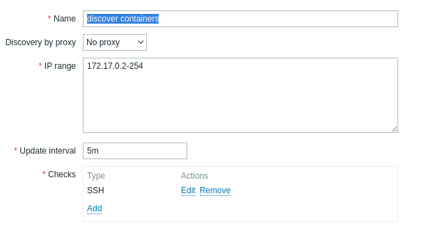
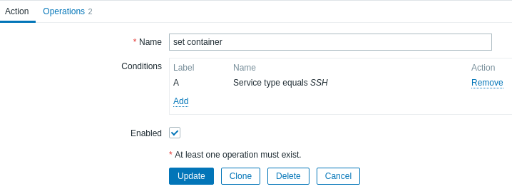
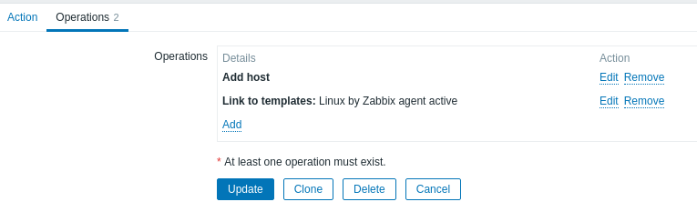
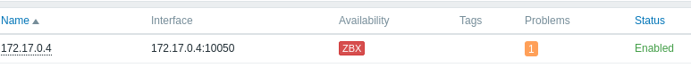

# Dynamic Inventory in Ansible
Set up a third party application, such a Zabbix, for managing dynamic inventory of containers

## Run zabbix
Completer l'installation avec un navigateur
```http://<ip>/zabbix```
user/Password is Admin/zabbix

## Configure Zabbix auto discovery 
Go to Configuration -> Discovery -> Create Discovery Rule   
  

Add actions  
Go to Configuration -> Actions -> Discovery Actions  Create action


Add Operations  


Check in Monitoring -> Hosts


Add another container  
```docker run -d --name target11 systemdevformations/ubuntu_ssh:v2```

## FYI - For getting containers ip addresses
```sql
select i.ip,h.name from hosts h, interface i, hosts_groups g
where h.hostid = i.hostid and h.hostid = g.hostid and h.status=0 and g.groupid = 5;
```
## zabbix.py program is using Zabbix API functions
Do a cd zabbbix 
```shell
pip3 install zabbix-api
chmod +x zabbix.py 
ZABBIX_TEMPLATES='Linux by Zabbix agent' ansible-playbook -i zabbix.py ../ansible_ping.yml
 ```
